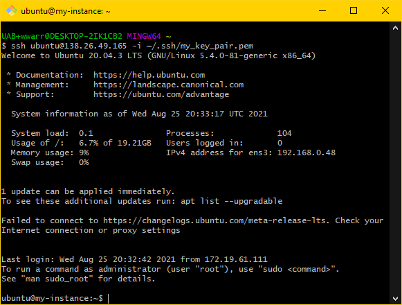

Basic Instance Setup
====================

Instances are the basic unit of compute on OpenStack. Requesting an instance involves a number of steps, and requires that a :doc:`network<network_setup_basic>` has already been setup. It is also possible to attach persistent reusable :doc:`volumes<volume_setup_basic>` to instances.

Creating a Floating IP
----------------------

Floating IPs are required if you want an instance to talk to devices on the internet. These IPs are a shared resource, so they must be allocated when needed and released when no longer needed.

1. Click "Network" in the left-hand navigation pane to open the fold-out menu.

   .. figure:: ./images/networks_000.png
      :alt: Image showing OpenStack Overview page. Networks is selected in the Network Topology fold-out menu in the left-hand navigation pane.

2. Click "Floating IPs".

   .. figure:: ./images/floating_ips_001.png
      :alt: Image showing OpenStack Floating IPs page. The Floating IPs table is empty.

3. Click "Allocate IP to Project" to open a dialog box.
4. Fill out the dialog box.

   a. Select "uab-campus" in the "Pool" drop down box.
   b. Enter a "Description".
   c. Leave "DNS Domain" empty.
   d. Leave "DNS Name" empty.

   .. figure:: ./images/floating_ips_002.png
      :alt: Image showing Allocate Floating IP dialog. The dialog form is empty.

5. Click "Allocate IP".

   a. Redirects to the "Floating IPs" page.
   b. There should be a new entry in the table.

   .. figure:: ./images/floating_ips_003.png
      :alt: Image showing Floating IPs page. The table has one entry.

Creating a Key Pair
-------------------

A Key Pair is required for SSH access to OpenStack instances for security reasons.

Using a password protected Key Pair is highly recommended for additional security, as it buys time to revoke a key if it is compromised by an attacker. Currently, this is only possible by uploading a custom public key generated on your local machine.

Good practice is to only use one key pair per person and per local machine. So if you have two computers, each one will need its own key pair. If you have two users, each will need their own key pair. Private keys are secrets and should not be passed around. Copying the key increases the risk of the system being compromised by an attacker.

1. Click "Compute" in the left-hand navigation pane to open the fold-out menu.

   .. figure:: ./images/key_pairs_000.png
      :alt: Image showing OpenStack Overview page. Key Pairs is selected in the Compute fold-out menu in the left-hand navigation pane.

2. Click "Key Pairs".

   .. figure:: ./images/key_pairs_001.png
      :alt: Image showing the Key Pairs page. The Key Pairs table is empty.

3. Click "+ Create Key Pair" to open a dialog box.
4. Fill out the dialog box.

   a. Enter a "Key Pair Name".
   b. Select "SSH Key" in the "Key Type" drop down box.

   .. figure:: ./images/key_pairs_002.png
      :alt: Image showing the Create Key pair dialog. The dialog form is filled out. The Key Pair Name is set to my_key_pair.

5. Click "+ Create Key Pair"

   a. Opens a download file dialog box in your browser to download a :code:`pem` file containing the secret private key.
   b. Download the :code:`pem` file. For security reasons this will be your only chance to ever obtain the private key from OpenStack.
   c. Failing to download the :code:`pem` file now means a new key pair will need to be created.

   .. figure:: ./images/key_pairs_003.png
      :alt: Image showing Download File dialog on Firefox for Windows. The file being downloaded is my_key_pair.pem.

   d. Redirects to the "Key Pairs" page.
   e. There should be a new entry in the table.

   .. figure:: ./images/key_pairs_004.png
      :alt: Image showing the Key Pairs page. The Key Pairs table has one entry labeled my_key_pair.

6. To use the private key on your local machine.

   a. :code:`mv` the :code:`pem` file to the :code:`.ssh` directory under your home directory. If you are on a Windows machine, you'll need to install ssh by one of various means.
   b. :code:`cd` to the :code:`.ssh` directory under your home directory.
   c. :code:`ssh-add <pem_file>` to add the private key to the ssh keyring for use by ssh.
   d. :code:`ssh-add -d <pem_file>` to remove the key.

   .. figure:: ./images/key_pairs_005.png
      :alt: Image showing MINGW64 terminal on Windows. Commands have been used to move the private key file into the ssh folder and add it to the ssh agent.

It is alternately possible to use a custom key pair created on your local machine. We assume you know how to create a key pair on your local machine and have already done so. To upload a key pair, replace steps 3 and 4 above with the following, perform step 5 from above, and skip step 6.

3. Click "Import Public Key" to open a dialog box.
4. Fill out the dialog box.

   a. Enter a "Key Pair Name".
   b. Select "SSH Key" in the "Key Type" drop-down box.
   c. Click "Browse..." to upload a public key file from your custom key pair **OR** copy-paste the content of that key file into the "Public Key" box.

   .. figure:: ./images/key_pairs_alt_002.png
      :alt: Image showing the Import Public Key dialog. The dialog form is empty.

Creating an Instance
--------------------

Creating an instance is possibly a step you'll perform often, depending on your workflow. There are many smaller steps to create an instance, so please take care to check all the fields when you create an instance.

These instructions require that you've set up a :doc:`network<network_setup_basic>` and followed all of the instructions on the linked page. You should have a Network, Subnet, outer and SSH Security Group. You will also need to setup a :ref:`Key Pair<Creating a Key Pair>` and a :ref:`Floating IP<Create a Floating IP>`.

1. Click "Compute" in the left-hand navigation pane to open the fold-out menu.

   .. figure:: ./images/key_pairs_000.png
      :alt: Image showing the OpenStack Overview page.

2. Click "Instances".

   .. figure:: ./images/instances_001.png
      :alt: Image showing the OpenStack Instances page. The Instances table is empty.

3. Click "Launch Instance" to open a dialog box.

4. Fill out the dialog box completely. There are several tabs that will need to be completed.

   .. figure:: ./images/instances_002.png
      :alt: Image showing the Launch Instance dialog. The dialog form has multiple tabs on the left menu. The Details tab is selected. The Details dialog form is empty except the Instance Name is set to my_instance.

5. "Details" tab.

   a. Enter an "Instance Name".
   b. Enter a "Description".
   c. Select "nova" in the "Availability Zone" drop down box.
   d. Select "1" in the "Count" field.
   e. Click "Next >" to move to the "Source" tab.

6. "Source" tab. Sources determine what operating system or pre-defined image will be used as the starting point for your operating system (OS).

   a. Select "Image" in the "Select Boot Source" drop down box.
   b. Select "Yes" under "Create New Volume".
   c. Choose an appropriate "Volume Size" in :code:`GiB`. Note that for many single-use instances, :code:`20 GiB` is more than enough. If you need more because you have persistent data, please create a :doc:`persistent volume<volume_setup_basic>`.
   d. Select "Yes" or "No" under "Delete Volume on Instance Delete"

      i. "Yes" is a good choice if the OS volume will be reused.
      ii. "No" is a good choice if you don't care about reusing the OS.

   .. figure:: ./images/instances_003.png
      :alt: Image showing the Launch Instance dialog. The Source tab is selected.

   e. Pick an image from the list under the "Available" section.

      i. Use the search box to help find the image that best suits your research needs.
      ii. When you find the best image, click the button with an up arrow next to the image.
      iii. The image will move to the "Allocated" section above the "Available" section.

   .. figure:: ./images/instances_004.png
      :alt: Image showing the Launch Instance dialog. The Source tab is selected. An Ubuntu 20.04 image has been moved up from the available images list to the allocated images list.

   f. Click "Next >" to move to the "Flavor" tab.

7. "Flavor" tab. Flavors determine what hardware will be available to your instance, including cpus, memory and gpus.

   a. Pick an instance flavor form the list under the "Available" section.

      i. Use the search box to help find the flavor that best suits your needs.
      ii. When you find the best flavor, click the button with an up arrow next to the flavor.
      iii. The flavor will move to the "Allocated" section above the "Available" section.

   .. figure:: ./images/instances_005.png
      :alt: Image showing the Launch Instance dialog. The Flavor tab is selected.

   b. Click "Next >" to move to the "Networks" tab.

8. "Networks" tab. Networks determine how your instance will talk to the internet and other instances. See :doc:`networking<network_setup_basic>` for more information.

   a. Pick a network from the list under the "Available' section.

      i. A Network may already be picked in the "Allocated" section. If this is not the correct Network, use the down arrow next to it to remove it from the "Allocated" section. If the Network is correct, skip (ii.) through (iv.).
      ii. Use the search box to help find the Network that best suits your needs.
      iii. When you find the best Network, click the button with an up arrow next to the Network.
      iv. The Network will move to the "Allocated" section above the "Available" section.

   .. figure:: ./images/instances_006.png
      :alt: Image showing the Launch Instance dialog. The Networks tab is selected.

   b. Click "Next >" to move to the "Network Ports" tab.

9. "Network Ports" tab. *Coming Soon!*

   a. Leave this tab empty.

   .. figure:: ./images/instances_007.png
      :alt: Image showing the Launch Instance dialog. The Network Ports tab is selected. The dialog form has been left empty.

   b. Click "Next >" to move to the "Security Groups" tab.

10. "Security Groups tab. Security Groups allow for fine-grained control over external access to your instance. For more information see :doc:`Creating a Security Group<network_setup_basic>` for more information.

    a. Pick the "ssh" Security Group from the "Available" section by pressing the up arrow next to it.
    b. The "default" Security Group should already be in the "Allocated" section.

    .. figure:: ./images/instances_008.png
       :alt: Image showing the Launch Instance dialog. The Security Groups tab is selected. The ssh security group has been moved up from the available list to the allocated list.

    c. Click "Next >" to move to the "Key Pair" tab.

11. "Key Pair" tab. Key Pairs allow individual access rights to the instance via SSH. For more information see :ref:`Creating a Key Pair`.

    a. Pick one or more key pairs from the list under the "Available" section.
       i. A Key Pair may already be picked in the "Allocated" section. If this is not the correct "Key Pair", use the down arrow next to it to remove it form the "Allocated" section. If the Key Pair is correct, skip (ii.) through (iv.).
       ii. Use the search box to help find the Key Pair that best suits your needs.
       iii. When you find the best Key Pair(s), click the button with an up arrow next to the Key Pair(s).
       iv. The Key Pair(s) will move to the "Allocated" section above the "Available" section.

    .. figure:: ./images/instances_009.png
       :alt: Image showing the Launch Instance dialog. The Key Pair tab is selected. The Key Pair my_key_pair has been moved up from the available list to the allocated list.

    b. Click "Next >" to move to the "Configuration" tab.

12. "Configuration" tab. *Coming Soon!*

    a. Skip this tab.
    b. Click "Next >" to move to the "Server Groups" tab.

13. "Server Groups" tab. *Coming Soon!*

    a. Skip this tab.
    b. Click "Next >" to move to the "Scheduler Hints" tab.

14. "Scheduler Hints" tab. *Coming Soon!*

    a. Skip this tab.
    b. Click "Next >" to move to the "Metadata" tab.

15. "Metadata" tab. *Coming Soon!*

    a. Skip this tab.

16. Click "Launch Instance" to launch the instance.

    a. Redirects to the "Instances" page.
    b. There should be a new entry in the table.

    .. figure:: ./images/instances_014.png
      :alt: Image showing OpenStack Instances page. The Instances table has one entry labeled my_instance. The task column has an indeterminate progress bar indicating the instance is being set up.

    c. The instance will take some time to build and boot. When the Status column entry says "Active" please move to the next steps.

    .. figure:: ./images/instances_015.png
       :alt: The task column of the Instances table reads none indicating the instance is ready for use.

17. Associate Floating IP.

    a. In the "Actions" column entry, click the drop down triangle and select "Associate Floating IP".
    b. A dialog box will open.
    c. Select an IP address in the "IP Address" drop down box.
    d. Select a port in the "Port to be associated" drop down box.
    e. Click "Associate" to return to the "Instances" page and associate the selected IP.

    .. figure:: ./images/instances_017.png
       :alt: Image showing the Manage Floating IP Associations dialog. The form is filled out. The Floating IP Address created earlier is selected under IP Address. The port from the Instance my_instance is selected under Port to be Associated.

At this stage you should be able to SSH into your instance from on campus or on the UAB VPN.

SSH Into the Instance
---------------------

If you are following the steps from top to bottom, then at this stage you should be able to SSH into your instance from on campus or on the UAB VPN. To do so be sure your local machine has ssh and then use the following command If you are using a different operating system, such as CentOS, replace the user :code:`ubuntu` with :code:`centos` or whatever is appropriate.

.. code-block:: bash

   ssh ubuntu@<floating ip> -i ~/.ssh/<keypair_name>.pem

ompt is waiting for input.
