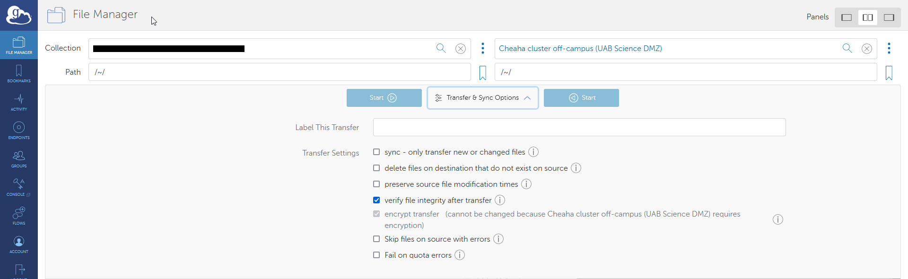
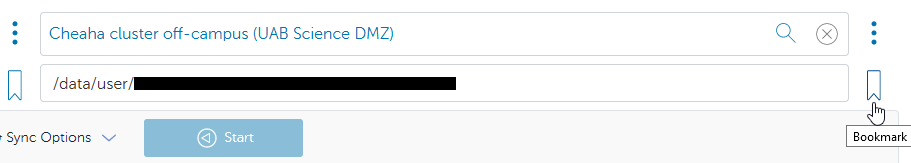
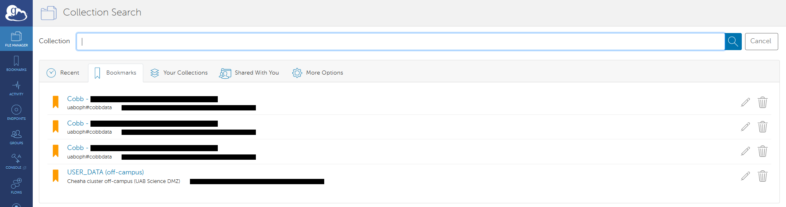

Globus
======

Setting up Globus Connect Personal
----------------------------------

`Globus Connect Personal <https://www.globus.org/globus-connect-personal>`_ is software meant to be installed on local machines such as laptops, desktops, workstations and self-owned, local-scale servers. Globus maintains excellent documentation for installation on `MacOS <https://docs.globus.org/how-to/globus-connect-personal-mac/>`_, `Linux <https://docs.globus.org/how-to/globus-connect-personal-linux>`_ and `Windows <https://docs.globus.org/how-to/globus-connect-personal-windows>`_.

To verify your installation is complete, please visit `<https://app.globus.org>`_ and log in. Click "Endpoints" in the left-hand navigation pane and then click the "Administered By You" tab. Look in the table for the endpoint you just created.

Moving Data Between Endpoints
-----------------------------

1. Log in to the Globus App online at https://app.globus.org using UAB Single Sign-On (SSO). Start typing "University of Alabama at Birmingham" into the "Use your existing organizational login" text box and selected it when it appears in the list.

   .. figure:: ./images/globus_001_login.png
      :alt: Globus login page with University of Alabama at Birmingham entered into the text box.

2. Click File Manager in the left-hand navigation pane.

   .. figure:: ./images/globus_002_nav_pane_file_manager.png
      :alt: Navigation pane with File Manager selected.

3. Ensure the center icon for the "Panels" selection is picked.

   .. figure:: ./images/globus_003_panels.png
      :alt: Panels selection widget with center icon selected. Center icon appears to be two side-by-side panes.

4. Click the "Search" icon in the "Collection" text box near the top-left or top-right of the page to locate an endpoint. There are multiple ways to find an endpoint. For some endpoints you may be asked to log in, which is true of all UAB endpoints. Some UAB endpoints may also require that you be on the UAB VPN.

   .. figure:: ./images/globus_004_search_bar.png
      :alt: Globus File Manager interface with mouse pointer over left-hand Collection Search box.

   a. Begin typing in the box to search for an endpoint. To find UAB-related endpoints, search for "UAB". There are two Cheaha endpoints

      i. Cheaha cluster on-campus (UAB Science DMZ) for machines that are on campus or connected to the VPN.
      ii. Cheaha cluster off-campus (UAB Science DMZ) for machines that are off campus and not on the VPN.

   b. The "Recent" tab shows endpoints that have most recently been used.

      .. figure:: ./images/globus_005_recent_tab.png
         :alt: Globus Collection Search Recent tab showing two endpoints.

   c. The "Bookmarks" tab shows a list of endpoint bookmarks.

      .. figure:: ./images/globus_006_bookmarks_tab.png
         :alt: Globus Collection Search Bookmarks tab showing four bookmarks.

   d. The "Your Collections" tab shows all endpoints owned by you. For most users this will be one or more Globus Connect Personal endpoints.

      .. figure:: ./images/globus_007_your_collections_tab.png
         :alt: Globus Collection Search Your Collections tab showing one endpoint.

   e. The "Shared With You" tab shows any private endpoints that have been shared with you by other users, possibly collaborators.
   f. The "More Options" tab will show a brief text on installing Globus Connect Personal.

5. When an endpoint has been selected you will see a list of folders and files on the default path for that endpoint in the bottom box. You can use the "Path" box to type a path to find the files you are looking for.

   .. figure:: ./images/globus_010_one_endpoint_done.png
      :alt: Globus File Manager interface with one endpoint selected showing files of default directory.

6. Repeat the process of selecting an endpoint for the other "Collection" text box.

   .. figure:: ./images/globus_011_two_endpoint_done.png
      :alt: Globus File Manager interface with both endpoints selected showing files for both default directories.

7. When both endpoints have been selected and you have chosen the correct paths for each endpoint, select files and/or folders on the side you wish to transfer FROM. We will call this side the source endpoint, and the other side the target endpoint. Selections may be made by clicking the checkboxes that appear when you hover over each file or folder.

   .. figure:: ./images/globus_012_selected_files.png
      :alt: Globus File Manager interface with files selected in left endpoint.

8. When all files and folders have been selected from the source endpoint, click the "Start" button on the source endpoint side. This will start a transfer process from source to target. The files will be placed in the currently open path on the target endpoint.

   .. figure:: ./images/globus_013_popup.png
      :alt: Pop-up showing Transfer request submitted successfully. Pop-up contains link to View details.

9.  A green pop-up notification will appear indicating the transfer has started. Click "View details >" to be taken to the status of the transfer. You can also check on the status of any transfers by clicking the "Activity" button in the left-hand navigation pane.

Transfer and Sync Options
~~~~~~~~~~~~~~~~~~~~~~~~~

Between the two "Start" buttons on the "File Manager" page is a "Transfer & Sync Options" drop down menu. Click that button to change the options. More information on each option. A brief summary of the options are...

1. sync - Sync files only, rather than create new files.
2. delete files - Delete any files on the target that are not on the source. Useful for forcing identical filesystems when syncing.
3. preserve source - Copies file "modified time" metadata.
4. verify integrity - Verifies that checksums are identical on source and target after transfer completes. Highly recommended to have this checked.
5. encrypt transfer - Encrypts data before leaving source and decrypts after arriving at destination. Recommended for all transfers, required and enforced for all UAB endpoints.
6. skip files - Skips source files that cause errors during the transfer. Otherwise the entire transfer will stop when an error is encountered.
7. quota fail - Fails instead of retries when the target storage quota is exceeded.

Common Errors
~~~~~~~~~~~~~

1. File Not Found - This may mean that a file was not readable by Globus. Check that the file hasn't moved or changed names during the transfer. It is recommended to not modify files while they are being transferred by Globus.
2. Permission Denied - Globus is not able to access the files because permissions do not allow it. For Globus Connect Personal, be sure the containing folder is on the "Accessible Folders" list. Be sure that your user account has access to read the file.

More Information
~~~~~~~~~~~~~~~~

A `Globus FAQ <https://docs.globus.org/faq/globus-connect-endpoints/>`_ is available for additional information on endpoints and transfers.

Using Bookmarks
---------------

To save a bookmark, use the File Manager interface to select an endpoint and navigate to a path on that endpoint. Then click the bookmark button as shown below.

To manage bookmarks, click "Bookmarks" in the left-hand navigation pane. Click the "Pencil" icon to edit a bookmark. Click the "Trash Bin" icon to delete a bookmark.

Setting up a Shared Collection from a Globus Connect Personal Endpoint
----------------------------------------------------------------------

It is NOT RECOMMENDED to make Globus Connect Personal endpoints public as this is insecure. It is more difficult to manage access controls for the entire Globus Connect Personal endpoint than for a shared collection. Be secure, create a shared collection!

1. Click "Endpoints" in the left-hand navigation pane.
2. Click the "Administered By You" tab.
3. In the table, find the endpoint you wish to share data from and click its name. You will be taken to the page for that endpoint.
4. Click the "Collections" tab.
5. Click the "Add a Guest Collection" button.
6. Fill out the form.

   a. Manually enter a path or click the Browse button to select a folder.
   b. Give a short but memorable name for your shared collection. This information will be useful for your collaborators.
   c. Optionally fill in a more detailed description of the shared collection for your records.
   d. Optionally fill in searchable keywords.

7. Click "Create Share" to move to the next step. You will be taken to the page for the newly created collection, which is now a full-fledged endpoint. Any further references to "an endpoint" will be about the newly created, shared collection.
8. Make sure you are on the "Permissions" tab.
9. Click "Add Permissions -- Share With" to share your endpoint with other users.
10. Fill out the form.

    a. Optionally enter a path within the shared endpoint or use the Browse button. If you leave the path as just a slash, the entire shared endpoint will be shared with these users.
    b. Select who to share with.

       i. User - One or more users.
       ii. Group - All members of a group.
       iii. All Users - All globus users. **Warning! This exposes data publicly!**

    c. Search for users to add, or a group, depending on your choice above. You should be able to find any globus user using the search box. **Warning! Be certain of which user you are selecting! Check the email domain!**
    d. If adding users, optionally enter a message so they know why they are being added.
    e. Select permissions. Read is automatically selected and cannot be changed. Write permissions are optional.

11. Click "Add Permission" to add permissions for these users or groups. You will be returned to the page for the shared endpoint and should be on the "Permissions" tab.

Setting up Globus Connect Server
--------------------------------

Under construction!
