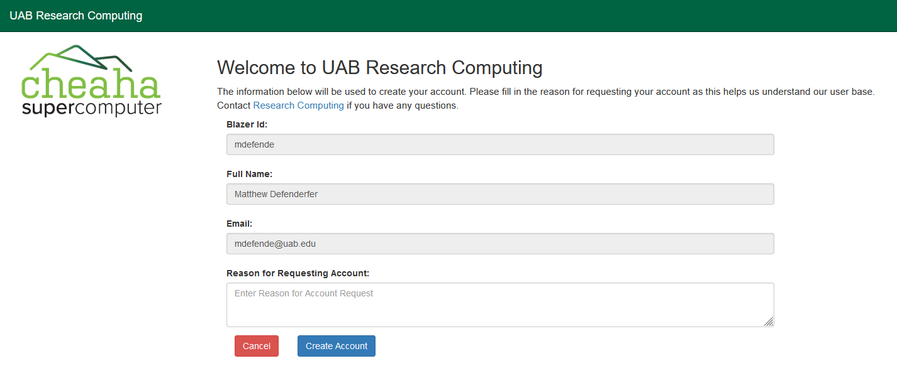

UAB User Instructions
=====================

These instructions are for users at UAB to request their own accounts on Cheaha
using the Open OnDemand web portal.

Navigate to `<https://rc.uab.edu>`__, authenticate with your UAB credentials, and if you
do not have a Cheaha account, you will see the screen shown below:

Your BlazerID and full name will already be filled in based on your
authentication credentials. Please fill out a reason for needing a Cheaha
account and press ``Create Account``. Your account should be created and ready
to use.